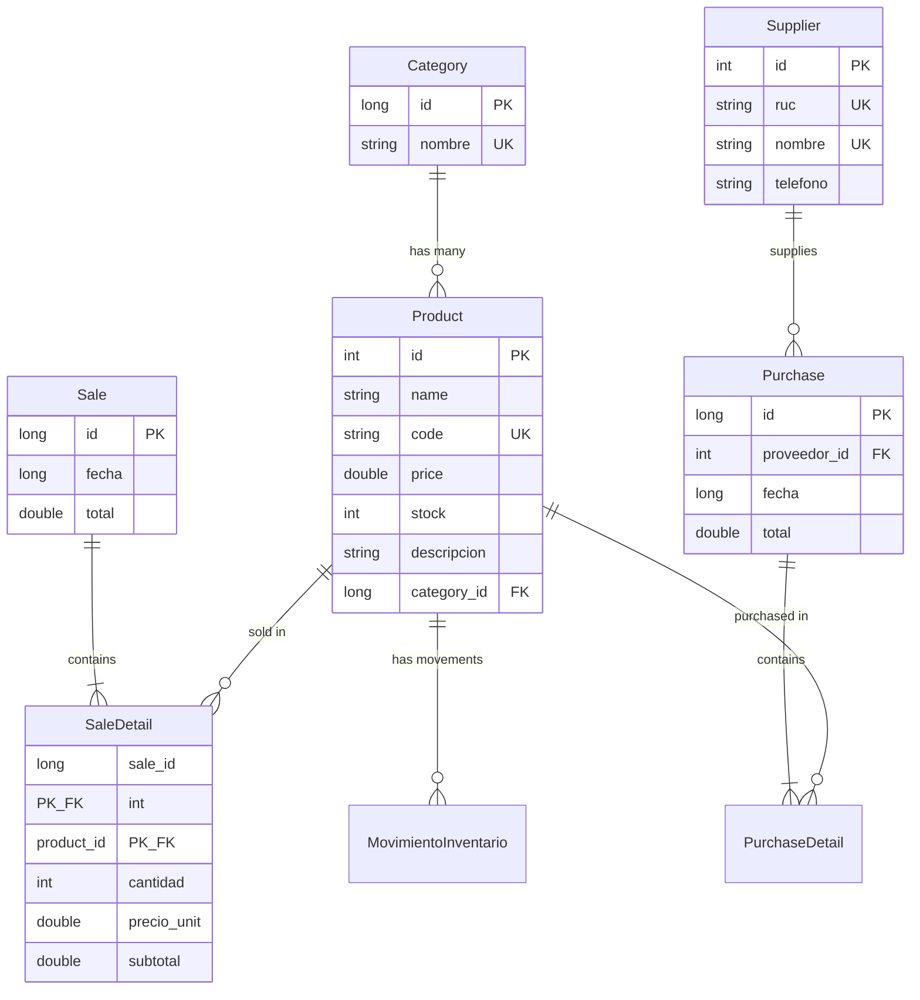

Bodeguita uses **Room** as its local database solution, providing an abstraction layer over SQLite with compile-time SQL validation and reactive query support.

## Database Configuration

The app database is configured in `AppDatabase.kt` with all entities and DAOs:

```kotlin AppDatabase.kt
package com.trabajo.minitienda.data.database

import androidx.room.Database
import androidx.room.RoomDatabase
import com.trabajo.minitienda.data.dao.*
import com.trabajo.minitienda.data.model.*

@Database(
    entities = [
        Product::class,
        Category::class,
        Sale::class,
        SaleDetail::class,
        Supplier::class,
        Purchase::class,
        PurchaseDetail::class,
        MovimientoInventario::class
    ],
    version = 8,
    exportSchema = true
)
abstract class AppDatabase : RoomDatabase() {
    abstract fun productDao(): ProductDao
    abstract fun categoryDao(): CategoryDao
    abstract fun saleDao(): SaleDao
    abstract fun supplierDao(): SupplierDao
    abstract fun purchaseDao(): PurchaseDao
    abstract fun movementDao(): MovementDao
}
```

### Database Provider (Singleton Pattern)

The app uses a singleton pattern to ensure only one database instance exists:

```kotlin Database Provider
object AppDbProvider {
    @Volatile 
    private var INSTANCE: AppDatabase? = null

    fun get(context: android.content.Context): AppDatabase =
        INSTANCE ?: synchronized(this) {
            androidx.room.Room.databaseBuilder(
                context.applicationContext,
                AppDatabase::class.java,
                "minitienda.db"
            )
                .fallbackToDestructiveMigration()
                .build()
                .also { INSTANCE = it }
        }
}
```

<Note>
`fallbackToDestructiveMigration()` means the database will be recreated if migrations are not provided. In production, you should implement proper migration strategies.
</Note>

## Database Schema

Here's an overview of the main entities and their relationships:



## Entity Definitions

### Product Entity

Products are the core of the inventory system with foreign key to Category:

```kotlin Product.kt
@Entity(
    tableName = "producto",
    indices = [
        Index(value = ["code"], unique = true),
        Index(value = ["category_id"])
    ],
    foreignKeys = [
        ForeignKey(
            entity = Category::class,
            parentColumns = ["id"],
            childColumns = ["category_id"],
            onDelete = ForeignKey.SET_NULL
        )
    ]
)
data class Product(
    @PrimaryKey(autoGenerate = true) val id: Int = 0,
    val name: String,
    val code: String,
    val price: Double,
    val stock: Int,
    val descripcion: String,
    @ColumnInfo(name = "category_id") val categoryId: Long? = null
)
```

<Accordion title="Key Features">
- **Unique Code**: Product codes must be unique (enforced by index)
- **Category Foreign Key**: Optional relationship with `SET_NULL` on delete
- **Indexed Fields**: `code` and `category_id` are indexed for fast queries
</Accordion>

### Category Entity

```kotlin Category.kt
@Entity(
    tableName = "categoria",
    indices = [Index(value = ["nombre"], unique = true)]
)
data class Category(
    @PrimaryKey(autoGenerate = true) val id: Long = 0,
    val nombre: String
)
```

### Sale Entities (Master-Detail Pattern)

Sales use a master-detail pattern with composite primary key:

<CodeGroup>
```kotlin Sale.kt (Master)
@Entity(tableName = "venta")
data class Sale(
    @PrimaryKey(autoGenerate = true) val id: Long = 0,
    val fecha: Long = System.currentTimeMillis(),
    val total: Double
)
```

```kotlin SaleDetail.kt (Detail)
@Entity(
    tableName = "detalle_venta",
    primaryKeys = ["sale_id", "product_id"],
    foreignKeys = [
        ForeignKey(
            entity = Sale::class,
            parentColumns = ["id"],
            childColumns = ["sale_id"],
            onDelete = ForeignKey.CASCADE
        ),
        ForeignKey(
            entity = Product::class,
            parentColumns = ["id"],
            childColumns = ["product_id"],
            onDelete = ForeignKey.RESTRICT
        )
    ],
    indices = [Index("product_id")]
)
data class SaleDetail(
    @ColumnInfo(name = "sale_id") val saleId: Long,
    @ColumnInfo(name = "product_id") val productId: Int,
    val cantidad: Int,
    @ColumnInfo(name = "precio_unit") val precioUnit: Double,
    val subtotal: Double
)
```

```kotlin SaleWithDetails.kt (Relation)
data class SaleWithDetails(
    @Embedded val sale: Sale,
    @Relation(
        parentColumn = "id",
        entityColumn = "sale_id",
        entity = SaleDetail::class
    )
    val items: List<SaleDetail>
)
```
</CodeGroup>

<Info>
**Foreign Key Strategies:**
- `CASCADE` on Sale deletion: When a sale is deleted, all its details are deleted
- `RESTRICT` on Product deletion: Cannot delete a product that has been sold
</Info>

### Purchase Entities (Similar Pattern)

```kotlin Purchase.kt
@Entity(tableName = "compra")
data class Purchase(
    @PrimaryKey(autoGenerate = true) val id: Long = 0,
    @ColumnInfo(name = "proveedor_id") val proveedorId: Int,
    val fecha: Long = System.currentTimeMillis(),
    val total: Double
)

@Entity(
    tableName = "detalle_compra",
    primaryKeys = ["purchase_id", "product_id"],
    foreignKeys = [
        ForeignKey(
            entity = Purchase::class,
            parentColumns = ["id"],
            childColumns = ["purchase_id"],
            onDelete = ForeignKey.CASCADE
        ),
        ForeignKey(
            entity = Product::class,
            parentColumns = ["id"],
            childColumns = ["product_id"],
            onDelete = ForeignKey.RESTRICT
        )
    ],
    indices = [Index("product_id")]
)
data class PurchaseDetail(
    @ColumnInfo(name = "purchase_id") val purchaseId: Long,
    @ColumnInfo(name = "product_id") val productId: Int,
    val cantidad: Int,
    @ColumnInfo(name = "costo_unit") val costoUnit: Double,
    val subtotal: Double = cantidad * costoUnit
)
```

### Supplier Entity

```kotlin Supplier.kt
@Entity(
    tableName = "proveedor",
    indices = [
        Index(value = ["ruc"], unique = true),
        Index(value = ["nombre"], unique = true)
    ]
)
data class Supplier(
    @PrimaryKey(autoGenerate = true) val id: Int = 0,
    val ruc: String,
    val nombre: String,
    val telefono: String? = null
)
```

## Data Access Objects (DAOs)

### ProductDao - Complete Example

```kotlin ProductDao.kt
@Dao
interface ProductDao {

    // --- REACTIVE QUERIES ---
    @Query("SELECT * FROM producto ORDER BY name ASC")
    fun observeAllProducts(): Flow<List<Product>>

    @Query("SELECT COUNT(*) FROM producto")
    suspend fun countAll(): Int

    // --- CRUD OPERATIONS ---
    @Delete 
    suspend fun deleteProduct(product: Product)
    
    @Update 
    suspend fun updateProduct(product: Product)

    // --- CUSTOM UPSERT LOGIC ---
    @Insert(onConflict = OnConflictStrategy.IGNORE)
    suspend fun insertIgnore(product: Product): Long

    @Query("""
        UPDATE producto
        SET name = :name, price = :price, stock = :stock, descripcion = :desc
        WHERE code = :code
    """)
    suspend fun updateByCode(
        name: String, 
        price: Double, 
        stock: Int, 
        desc: String, 
        code: String
    ): Int

    @Query("SELECT * FROM producto WHERE code = :code LIMIT 1")
    suspend fun findByCode(code: String): Product?

    // Stock management
    @Query("""
        UPDATE producto 
        SET stock = stock - :qty 
        WHERE id = :productId AND stock >= :qty
    """)
    suspend fun decreaseStock(productId: Int, qty: Int): Int

    // Transaction combining insert + update
    @Transaction
    suspend fun upsertByCode(p: Product) {
        val id = insertIgnore(p)
        if (id == -1L) {
            // Product already exists, update it
            updateByCode(p.name, p.price, p.stock, p.descripcion, p.code)
        }
    }
}
```

<Accordion title="Upsert Pattern Explained">
The `upsertByCode` function implements an "insert or update" pattern:

1. Try to insert with `IGNORE` conflict strategy
2. If insert returns `-1L`, the product code already exists
3. In that case, update the existing product by code
4. This ensures products are never duplicated by code
</Accordion>

### SaleDao - Advanced Queries

```kotlin SaleDao.kt
@Dao
interface SaleDao {
    @Insert
    suspend fun insertSale(sale: Sale): Long

    @Insert
    suspend fun insertDetails(details: List<SaleDetail>)

    // Get sales with their details using @Transaction
    @Transaction
    @Query("SELECT * FROM venta ORDER BY fecha DESC")
    fun observeSales(): Flow<List<SaleWithDetails>>

    // Weekly summary with SQLite date functions
    @Query("""
        SELECT 
            DATE(fecha / 1000, 'unixepoch', 'localtime') AS saleDate, 
            SUM(total) AS total  
        FROM venta                 
        WHERE fecha >= :sevenDaysAgoTimestamp 
        GROUP BY saleDate
        ORDER BY saleDate ASC
    """)
    fun getWeeklySalesSummary(sevenDaysAgoTimestamp: Long): Flow<List<DailySaleSummary>>

    // Today's sales count
    @Query("""
        SELECT COUNT(*) 
        FROM venta
        WHERE DATE(fecha / 1000, 'unixepoch', 'localtime') = DATE('now','localtime')
    """)
    fun todaySalesCount(): Flow<Int>

    // Today's total revenue
    @Query("""
        SELECT COALESCE(SUM(total), 0.0)
        FROM venta
        WHERE DATE(fecha / 1000, 'unixepoch', 'localtime') = DATE('now','localtime')
    """)
    fun todaySalesTotal(): Flow<Double>

    // Units sold today (join with details)
    @Query("""
        SELECT COALESCE(SUM(d.cantidad), 0)
        FROM detalle_venta d
        INNER JOIN venta v ON v.id = d.sale_id
        WHERE DATE(v.fecha / 1000, 'unixepoch', 'localtime') = DATE('now','localtime')
    """)
    fun todayUnitsSold(): Flow<Int>

    // Last sale (for dashboard)
    @Query("""
        SELECT v.id AS id, v.total AS total, v.fecha AS fecha
        FROM venta v
        ORDER BY v.fecha DESC
        LIMIT 1
    """)
    fun lastSaleBrief(): Flow<SaleBrief?>

    // Delete today's sales (for cash closure reset)
    @Query("""
        DELETE FROM venta
        WHERE DATE(fecha / 1000, 'unixepoch', 'localtime') = DATE('now','localtime')
    """)
    suspend fun deleteTodaySales()
}
```

<Info>
**SQLite Date Functions:**

Room supports SQLite's built-in date functions:
- `DATE(milliseconds / 1000, 'unixepoch', 'localtime')` converts timestamps to local dates
- `DATE('now', 'localtime')` gets today's date
- These allow filtering by day without storing date strings
</Info>

## Relationships and Joins

### One-to-Many: Sale with Details

The `@Relation` annotation automatically fetches related entities:

```kotlin
data class SaleWithDetails(
    @Embedded val sale: Sale,
    @Relation(
        parentColumn = "id",
        entityColumn = "sale_id",
        entity = SaleDetail::class
    )
    val items: List<SaleDetail>
)

// Usage in DAO
@Transaction
@Query("SELECT * FROM venta WHERE id = :saleId")
suspend fun getSaleWithDetails(saleId: Long): SaleWithDetails?
```

### Composite Primary Keys

Detail tables use composite keys to prevent duplicate entries:

```kotlin
@Entity(
    tableName = "detalle_venta",
    primaryKeys = ["sale_id", "product_id"],
    // ...
)
data class SaleDetail(
    @ColumnInfo(name = "sale_id") val saleId: Long,
    @ColumnInfo(name = "product_id") val productId: Int,
    // ...
)
```

This ensures a product can only appear once per sale.

## Database Initialization

### Migration Strategy

Currently using destructive migration:

```kotlin
.fallbackToDestructiveMigration()
```

<Warning>
In production, implement proper migrations:

```kotlin
val MIGRATION_7_8 = object : Migration(7, 8) {
    override fun migrate(database: SupportSQLiteDatabase) {
        database.execSQL(
            "ALTER TABLE producto ADD COLUMN descripcion TEXT NOT NULL DEFAULT ''"
        )
    }
}

Room.databaseBuilder(context, AppDatabase::class.java, "minitienda.db")
    .addMigrations(MIGRATION_7_8)
    .build()
```
</Warning>

## Transaction Management

Room handles transactions automatically for `@Insert`, `@Update`, and `@Delete`. For complex operations, use `@Transaction`:

```kotlin
@Transaction
suspend fun makeSale(sale: Sale, details: List<SaleDetail>) {
    val saleId = insertSale(sale)
    val updatedDetails = details.map { it.copy(saleId = saleId) }
    insertDetails(updatedDetails)
    
    // Decrease stock for each product
    details.forEach { detail ->
        decreaseStock(detail.productId, detail.cantidad)
    }
}
```

If any operation fails, the entire transaction is rolled back.

## Best Practices

<AccordionGroup>
  <Accordion title="Use Flow for Reactive Queries">
    Return `Flow<T>` from DAOs instead of `LiveData` or suspend functions. Flow integrates better with coroutines and Compose.
    
    ```kotlin
    // ✅ Good
    @Query("SELECT * FROM producto")
    fun observeAllProducts(): Flow<List<Product>>
    
    // ❌ Avoid
    @Query("SELECT * FROM producto")
    fun getAllProducts(): LiveData<List<Product>>
    ```
  </Accordion>
  
  <Accordion title="Index Foreign Keys">
    Always create indexes on foreign key columns for better join performance.
    
    ```kotlin
    @Entity(
        tableName = "producto",
        indices = [Index(value = ["category_id"])],
        foreignKeys = [...]
    )
    ```
  </Accordion>
  
  <Accordion title="Use Suspend Functions">
    All write operations should be suspend functions to run on background threads.
    
    ```kotlin
    @Insert
    suspend fun insertProduct(product: Product)
    ```
  </Accordion>
  
  <Accordion title="Explicit Column Names">
    Use `@ColumnInfo` for clarity, especially with snake_case SQL conventions.
    
    ```kotlin
    @ColumnInfo(name = "category_id") val categoryId: Long?
    ```
  </Accordion>
  
  <Accordion title="Handle Cascades Carefully">
    Choose appropriate `onDelete` strategies:
    - `CASCADE`: Child records deleted with parent (sale details)
    - `RESTRICT`: Prevent deletion if children exist (products with sales)
    - `SET_NULL`: Nullify foreign key (product category)
  </Accordion>
</AccordionGroup>

## Performance Optimization

### Indexes

The schema includes strategic indexes:

```kotlin
indices = [
    Index(value = ["code"], unique = true),      // Fast product lookups
    Index(value = ["category_id"]),              // Fast category filtering
    Index(value = ["ruc"], unique = true),       // Supplier RUC lookups
    Index(value = ["nombre"], unique = true)     // Name-based searches
]
```

### Query Optimization

```kotlin
// ✅ Good - Uses index on fecha
@Query("""
    SELECT * FROM venta 
    WHERE fecha >= :startDate 
    ORDER BY fecha DESC
""")

// ✅ Good - Aggregation without loading all data
@Query("SELECT COUNT(*) FROM venta WHERE fecha >= :startDate")
suspend fun countSalesSince(startDate: Long): Int

// ❌ Avoid - Loading all data just to count
suspend fun countSalesSince(startDate: Long): Int {
    return getAllSales().filter { it.fecha >= startDate }.size
}
```

## Next Steps

<CardGroup cols={2}>
  <Card title="MVVM Pattern" icon="layer-group" href="/architecture/mvvm-pattern">
    Learn how ViewModels interact with the database
  </Card>
  
  <Card title="Architecture Overview" icon="sitemap" href="/architecture/overview">
    Return to the architecture overview
  </Card>
</CardGroup>