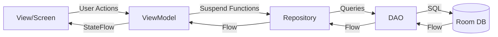

Bodeguita implements the **MVVM (Model-View-ViewModel)** architectural pattern to separate business logic from UI code, making the app more testable, maintainable, and scalable.

## MVVM Components

<CardGroup cols={3}>
  <Card title="Model" icon="database">
    Data layer with Room entities and DAOs
  </Card>
  
  <Card title="ViewModel" icon="code">
    Business logic and state management
  </Card>
  
  <Card title="View" icon="desktop">
    Jetpack Compose UI screens
  </Card>
</CardGroup>

## Pattern Overview



## Real Example: Product Management

Let's examine how the Product feature implements MVVM across all layers.

### 1. Model Layer (Data)

The Model represents the data structure and persistence logic.

<CodeGroup>
```kotlin Product.kt (Entity)
package com.trabajo.minitienda.data.model

import androidx.room.*

@Entity(
    tableName = "producto",
    indices = [
        Index(value = ["code"], unique = true),
        Index(value = ["category_id"])
    ],
    foreignKeys = [
        ForeignKey(
            entity = Category::class,
            parentColumns = ["id"],
            childColumns = ["category_id"],
            onDelete = ForeignKey.SET_NULL
        )
    ]
)
data class Product(
    @PrimaryKey(autoGenerate = true) val id: Int = 0,
    val name: String,
    val code: String,
    val price: Double,
    val stock: Int,
    val descripcion: String,
    @ColumnInfo(name = "category_id") val categoryId: Long? = null
)
```

```kotlin ProductDao.kt
package com.trabajo.minitienda.data.dao

import androidx.room.*
import kotlinx.coroutines.flow.Flow

@Dao
interface ProductDao {
    // Reactive query - emits new list whenever data changes
    @Query("SELECT * FROM producto ORDER BY name ASC")
    fun observeAllProducts(): Flow<List<Product>>
    
    // Find product by unique code
    @Query("SELECT * FROM producto WHERE code = :code LIMIT 1")
    suspend fun findByCode(code: String): Product?
    
    // CRUD operations
    @Delete 
    suspend fun deleteProduct(product: Product)
    
    @Update 
    suspend fun updateProduct(product: Product)
    
    // Custom upsert logic (insert or update)
    @Insert(onConflict = OnConflictStrategy.IGNORE)
    suspend fun insertIgnore(product: Product): Long
    
    @Query("""
        UPDATE producto
        SET name = :name, price = :price, stock = :stock, descripcion = :desc
        WHERE code = :code
    """)
    suspend fun updateByCode(
        name: String, 
        price: Double, 
        stock: Int, 
        desc: String, 
        code: String
    ): Int
    
    @Transaction
    suspend fun upsertByCode(p: Product) {
        val id = insertIgnore(p)
        if (id == -1L) {
            // Product exists, update it
            updateByCode(p.name, p.price, p.stock, p.descripcion, p.code)
        }
    }
    
    // Stock management
    @Query("""
        UPDATE producto 
        SET stock = stock - :qty 
        WHERE id = :productId AND stock >= :qty
    """)
    suspend fun decreaseStock(productId: Int, qty: Int): Int
}
```

```kotlin ProductRepository.kt
package com.trabajo.minitienda.repository

import com.trabajo.minitienda.data.dao.ProductDao
import com.trabajo.minitienda.data.model.Product

class ProductRepository(private val productDao: ProductDao) {
    
    // Expose reactive data stream
    fun observeAllProducts() = productDao.observeAllProducts()
    
    // Delegate operations to DAO
    suspend fun upsertByCode(p: Product) = productDao.upsertByCode(p)
    
    suspend fun deleteProduct(p: Product) = productDao.deleteProduct(p)
    
    suspend fun updateProduct(p: Product) = productDao.updateProduct(p)
    
    suspend fun countAll(): Int = productDao.countAll()
}
```
</CodeGroup>

### 2. ViewModel Layer (Business Logic)

The ViewModel manages UI state and orchestrates business operations.

<CodeGroup>
```kotlin ProductViewModel.kt
package com.trabajo.minitienda.viewmodel

import androidx.lifecycle.ViewModel
import androidx.lifecycle.viewModelScope
import com.trabajo.minitienda.data.model.Product
import com.trabajo.minitienda.repository.ProductRepository
import kotlinx.coroutines.flow.*
import kotlinx.coroutines.launch

class ProductViewModel(private val repository: ProductRepository) : ViewModel() {

    // StateFlow - Reactive state that UI observes
    val products: StateFlow<List<Product>> =
        repository.observeAllProducts()
            .stateIn(
                scope = viewModelScope,
                started = SharingStarted.WhileSubscribed(5_000),
                initialValue = emptyList()
            )

    // SharedFlow - One-time events (snackbar messages, navigation)
    private val _events = MutableSharedFlow<String>(extraBufferCapacity = 1)
    val events: SharedFlow<String> = _events.asSharedFlow()

    // Business operations
    fun upsertProduct(product: Product) = viewModelScope.launch {
        try {
            repository.upsertByCode(product)
            _events.tryEmit("Producto guardado")
        } catch (e: Exception) {
            _events.tryEmit("Error al guardar: ${e.message ?: "desconocido"}")
        }
    }

    fun deleteProduct(product: Product) = viewModelScope.launch {
        repository.deleteProduct(product)
    }

    fun updateProduct(product: Product) = viewModelScope.launch {
        repository.updateProduct(product)
    }
}
```

```kotlin ProductViewModelFactory.kt
package com.trabajo.minitienda.viewmodel

import androidx.lifecycle.ViewModel
import androidx.lifecycle.ViewModelProvider
import com.trabajo.minitienda.repository.ProductRepository

class ProductViewModelFactory(
    private val repository: ProductRepository
) : ViewModelProvider.Factory {
    override fun <T : ViewModel> create(modelClass: Class<T>): T {
        if (modelClass.isAssignableFrom(ProductViewModel::class.java)) {
            @Suppress("UNCHECKED_CAST")
            return ProductViewModel(repository) as T
        }
        throw IllegalArgumentException("Unknown ViewModel class")
    }
}
```
</CodeGroup>

<Note>
**Why ViewModelFactory?** 

ViewModels require a `Repository` dependency. The Factory pattern allows us to inject dependencies during ViewModel creation. In screens, you use:

```kotlin
val viewModel: ProductViewModel = viewModel(
    factory = ProductViewModelFactory(productRepository)
)
```
</Note>

### 3. View Layer (UI)

The View observes ViewModel state and displays UI using Jetpack Compose.

```kotlin ProductListScreen.kt
package com.trabajo.minitienda.screens

import androidx.compose.foundation.layout.*
import androidx.compose.foundation.lazy.LazyColumn
import androidx.compose.foundation.lazy.items
import androidx.compose.material3.*
import androidx.compose.runtime.*
import androidx.compose.ui.Modifier
import androidx.navigation.NavController
import com.trabajo.minitienda.viewmodel.ProductViewModel

@Composable
fun ProductListScreen(
    navController: NavController,
    productViewModel: ProductViewModel,
    onMenuClick: () -> Unit = {}
) {
    // Observe state from ViewModel
    val products by productViewModel.products.collectAsState()
    
    // Local UI state for search
    var query by rememberSaveable { mutableStateOf("") }
    
    // Derived state - automatically updates when products or query changes
    val filteredProducts by remember(products, query) {
        derivedStateOf {
            val q = query.trim().lowercase()
            if (q.isBlank()) products
            else products.filter { p ->
                p.name.lowercase().contains(q) || 
                p.code.lowercase().contains(q) ||
                p.descripcion.lowercase().contains(q)
            }
        }
    }
    
    // Collect one-time events
    LaunchedEffect(Unit) {
        productViewModel.events.collect { message ->
            // Show snackbar or toast
        }
    }
    
    PageLayout(
        title = "Productos",
        onMenuClick = onMenuClick
    ) {
        Column {
            SearchField(
                value = query,
                onValueChange = { query = it },
                placeholder = "Buscar productos..."
            )
            
            if (filteredProducts.isEmpty()) {
                EmptyState("No hay productos")
            } else {
                LazyColumn {
                    items(filteredProducts) { product ->
                        ProductCard(
                            product = product,
                            onDelete = { 
                                productViewModel.deleteProduct(product) 
                            },
                            onEdit = { 
                                navController.navigate("product_registration/${product.id}") 
                            }
                        )
                    }
                }
            }
        }
    }
}
```

## State Management Patterns

### StateFlow vs SharedFlow

Bodeguita uses two types of reactive streams:

<CodeGroup>
```kotlin StateFlow - Persistent State
// For data that should always have a current value
val products: StateFlow<List<Product>> = 
    repository.observeAllProducts()
        .stateIn(
            scope = viewModelScope,
            started = SharingStarted.WhileSubscribed(5_000),
            initialValue = emptyList()
        )

// UI observes with collectAsState()
val products by productViewModel.products.collectAsState()
```

```kotlin SharedFlow - One-Time Events
// For events that should only fire once (snackbars, navigation)
private val _events = MutableSharedFlow<String>(extraBufferCapacity = 1)
val events: SharedFlow<String> = _events.asSharedFlow()

// Emit events
_events.tryEmit("Producto guardado")

// UI collects with LaunchedEffect
LaunchedEffect(Unit) {
    productViewModel.events.collect { message ->
        snackbarHostState.showSnackbar(message)
    }
}
```
</CodeGroup>

### Complex State: Sales with Cart

The Sales feature demonstrates more complex state management:

```kotlin SalesViewModel.kt
class SalesViewModel(
    private val repo: SaleRepository,
    private val productDao: ProductDao
) : ViewModel() {

    // Cart state
    private val _cart = MutableStateFlow<List<CartItem>>(emptyList())
    val cart: StateFlow<List<CartItem>> = _cart.asStateFlow()

    // Derived state - total is computed from cart
    val total: StateFlow<Double> = cart
        .map { items -> items.sumOf { it.product.price * it.qty } }
        .stateIn(viewModelScope, SharingStarted.WhileSubscribed(5_000), 0.0)

    // Events
    private val _events = MutableSharedFlow<String>(extraBufferCapacity = 1)
    val events: SharedFlow<String> = _events

    // Add product to cart by code
    fun addByCode(code: String, qty: Int) = viewModelScope.launch {
        val p = productDao.findByCode(code.trim().uppercase())
        if (p == null) {
            _events.tryEmit("Código no encontrado")
            return@launch
        }
        if (qty <= 0) {
            _events.tryEmit("Cantidad inválida")
            return@launch
        }
        
        // Update cart state
        val current = _cart.value.toMutableList()
        val index = current.indexOfFirst { it.product.id == p.id }
        if (index >= 0) {
            val old = current[index]
            current[index] = old.copy(qty = old.qty + qty)
        } else {
            current += CartItem(p, qty)
        }
        _cart.value = current
    }

    fun changeQty(productId: Int, qty: Int) {
        _cart.update { list -> 
            list.map { 
                if (it.product.id == productId) 
                    it.copy(qty = qty.coerceAtLeast(1)) 
                else it 
            } 
        }
    }

    fun remove(productId: Int) {
        _cart.update { list -> list.filterNot { it.product.id == productId } }
    }

    fun clearCart() { 
        _cart.value = emptyList() 
    }

    fun finalizeSale() = viewModelScope.launch {
        try {
            val id = repo.makeSale(_cart.value)
            clearCart()
            _events.tryEmit("Venta realizada (#$id)")
        } catch (e: Exception) {
            _events.tryEmit(e.message ?: "Error al registrar la venta")
        }
    }
}
```

## ViewModelScope and Coroutines

<Info>
**viewModelScope** is a coroutine scope tied to the ViewModel's lifecycle. When the ViewModel is cleared (e.g., user navigates away), all coroutines in this scope are automatically cancelled.
</Info>

```kotlin
// ✅ Good - Coroutine is lifecycle-aware
fun deleteProduct(product: Product) = viewModelScope.launch {
    repository.deleteProduct(product)
}

// ❌ Bad - Coroutine may leak
fun deleteProduct(product: Product) = GlobalScope.launch {
    repository.deleteProduct(product)
}
```

## Benefits of MVVM in Bodeguita

<AccordionGroup>
  <Accordion title="Separation of Concerns">
    Business logic is isolated in ViewModels, making it easy to test without UI dependencies.
  </Accordion>
  
  <Accordion title="Testability">
    ViewModels can be unit tested independently. You can mock repositories and test business logic in isolation.
  </Accordion>
  
  <Accordion title="Lifecycle Awareness">
    ViewModels survive configuration changes (rotation). UI state is preserved automatically.
  </Accordion>
  
  <Accordion title="Reactive UI Updates">
    Using Flow and StateFlow, the UI automatically updates when data changes. No manual refresh needed.
  </Accordion>
  
  <Accordion title="Single Source of Truth">
    Room database is the source of truth. ViewModels expose reactive streams from the database.
  </Accordion>
</AccordionGroup>

## Common Patterns

### Pattern 1: Reactive List Display

```kotlin
// ViewModel exposes StateFlow
val products: StateFlow<List<Product>> = repository.observeAllProducts()
    .stateIn(viewModelScope, SharingStarted.WhileSubscribed(5_000), emptyList())

// Screen observes and renders
val products by productViewModel.products.collectAsState()
LazyColumn {
    items(products) { product ->
        ProductCard(product)
    }
}
```

### Pattern 2: User Action → Database Update

```kotlin
// User clicks delete button in UI
Button(onClick = { productViewModel.deleteProduct(product) }) {
    Text("Delete")
}

// ViewModel executes in coroutine
fun deleteProduct(product: Product) = viewModelScope.launch {
    repository.deleteProduct(product)
}

// Repository calls DAO
suspend fun deleteProduct(p: Product) = productDao.deleteProduct(p)

// DAO updates database
@Delete suspend fun deleteProduct(product: Product)

// Database emits updated list through Flow
// UI automatically recomposes with new data
```

### Pattern 3: Form Submission with Validation

```kotlin
// ViewModel handles validation and submission
fun upsertProduct(product: Product) = viewModelScope.launch {
    try {
        repository.upsertByCode(product)
        _events.tryEmit("Producto guardado")
    } catch (e: Exception) {
        _events.tryEmit("Error: ${e.message}")
    }
}

// UI shows feedback
LaunchedEffect(Unit) {
    productViewModel.events.collect { message ->
        snackbarHostState.showSnackbar(message)
    }
}
```

## Next Steps

<CardGroup cols={2}>
  <Card title="Database Schema" icon="database" href="/architecture/database">
    Learn about Room database entities and relationships
  </Card>
  
  <Card title="Architecture Overview" icon="sitemap" href="/architecture/overview">
    Return to the architecture overview
  </Card>
</CardGroup>